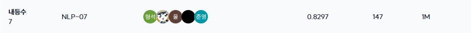
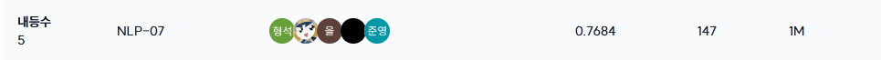

# 🏆 수능형 문제 풀이 모델 생성

---

## 📌 프로젝트 개요

---

| 항목 | 내용 |
|---|---|
| 프로젝트 주제 | 한국어 수능(국어·사회)과 유사한 지문 기반 객관식 문제를 풀 수 있는 모델을 개발하는 것입니다. |
| 프로젝트 목표 | 수능에 최적화된 모델을 만들어, 작은 모델로도 GPT, Claude, Gemini 같은 대형 모델들을 뛰어넘는 것입니다. |
| 진행 기간 | 2025.12.17 ~ 2026.01.06 |
| 평가 지표 | Macro F1-score: 각 클래스의 F1-score를 단순 평균 |

## 🎖️ 리더보드

---

### Public 7위



### Private 5위



## 🤝 팀원

---

| 이름 | 역할 |
|---|---|
| 가을 | wikipedia 문서로 RAG 실험 |
| 박신지 | DeepSeek Distill Qwen2.5 32B 실험, 공무원 시험 데이터로 증강 시도, Wikipedia api 이용한 RAG |
| 박희권 | 베이스 모델 선정, 모델 학습 방법론 실험, 앙상블 조합 탐색 |
| 이형석 | CoT, ORPO, RAG, SC 등 다양한 추론 학습 기법 실험 |

## 📝 Wrap-Up Report

---

프로젝트 진행에  대한 자세한 내용은 [wrapup_report.pdf](docs/wrapup_report.pdf)를 통해 확인할 수 있습니다.

## 프로젝트 구조

```
pro-nlp-generationfornlp-nlp-07/
├── .github/
│   ├── ISSUE_TEMPLATE/          # GitHub Issue 템플릿
│   └── workflows/               # CI/CD 워크플로우
├── data/                        # 데이터 파일 (.gitignore)
│   ├── train/
│   └── test/
├── notebooks/                   # 실험용 노트북 (선택사항)
│   └── experiments/            # 각 팀원의 실험 노트북
├── src/                         # 소스 코드
│   ├── config/                  # 설정 파일
│   ├── data/                    # 데이터 처리
│   ├── models/                  # 모델 로딩 및 설정
│   ├── training/                 # 훈련 관련
│   ├── inference/               # 추론 관련
│   └── utils/                   # 유틸리티 함수
├── scripts/                     # 실행 스크립트
│   ├── train.py                 # 훈련 스크립트
│   ├── inference.py             # 추론 스크립트
│   └── experiments/             # 각 팀원의 실험 스크립트
│       └── memberA/             # 팀원A의 실험 예시
├── experiments/                 # 실험 결과 및 로그
├── outputs/                     # 훈련 출력 (.gitignore)
├── submissions/                 # 제출 파일
├── requirements.txt             # 패키지 의존성
├── .env.example                 # 환경 변수 템플릿
└── README.md                    # 이 파일
```

## 설치 및 설정

### 1. 가상환경 생성 및 활성화

```bash
python3.10 -m venv --system-site-packages .venv
source .venv/bin/activate  # Linux/Mac
# 또는
.venv\Scripts\activate  # Windows
```

### 2. 패키지 설치

```bash
pip install --upgrade pip
pip install -r requirements.txt
```

### 3. 환경 변수 설정

`.env.example` 파일을 참고하여 `.env` 파일을 생성하고 Hugging Face 토큰을 설정하세요:

```bash
cp .env.example .env
# .env 파일을 편집하여 HF_TOKEN을 설정
```

### 4. 데이터 다운로드 및 폴더 구조 설정

데이터를 다운로드하고 압축을 해제한 후, 다음 폴더 구조로 정리해야 합니다:

```bash
# 데이터 다운로드 (예시)
wget <데이터링크>

# 압축 해제
tar -xzf data.tar.gz

# 폴더 구조 정리
mkdir -p data/train data/test
mv data/train.csv data/train/
mv data/test.csv data/test/
```

최종 폴더 구조:
```
data/
├── train/
│   └── train.csv
└── test/
    └── test.csv
```

> **참고**: 프로젝트는 `data/train/train.csv`와 `data/test/test.csv` 경로를 사용합니다.

## 사용 방법

### 기본 훈련

```bash
python scripts/train.py
```

**자동 기능:**
- 학습 중 best model이 `outputs/outputs_gemma/best_model/`에 자동 저장됩니다
- 학습 완료 후 자동으로 Hugging Face에 업로드됩니다 (`.env`의 `HF_TOKEN`과 `config.py`의 `HF_MODEL_NAME` 설정 필요)
  - Best model → main 브랜치
  - 각 checkpoint → 별도 브랜치 (예: `checkpoint-2994`, `checkpoint-4491`)

### 추론

```bash
python scripts/inference.py --checkpoint <checkpoint_path> --test-data <test_data_path>
```

또는 최신 체크포인트 사용:
```bash
python scripts/inference.py
```

**사용 예시:**
```bash
# 특정 checkpoint 사용
python scripts/inference.py --checkpoint outputs/outputs_gemma/checkpoint-1000

# best_model 사용
python scripts/inference.py --checkpoint outputs/outputs_gemma/best_model
```

**Submission 파일 저장 위치:**
- Checkpoint 이름과 동일한 폴더에 자동으로 저장됩니다
- 예: `checkpoint-1000` → `submissions/checkpoint-1000/output.csv`
- 예: `best_model` → `submissions/best_model/output.csv`

